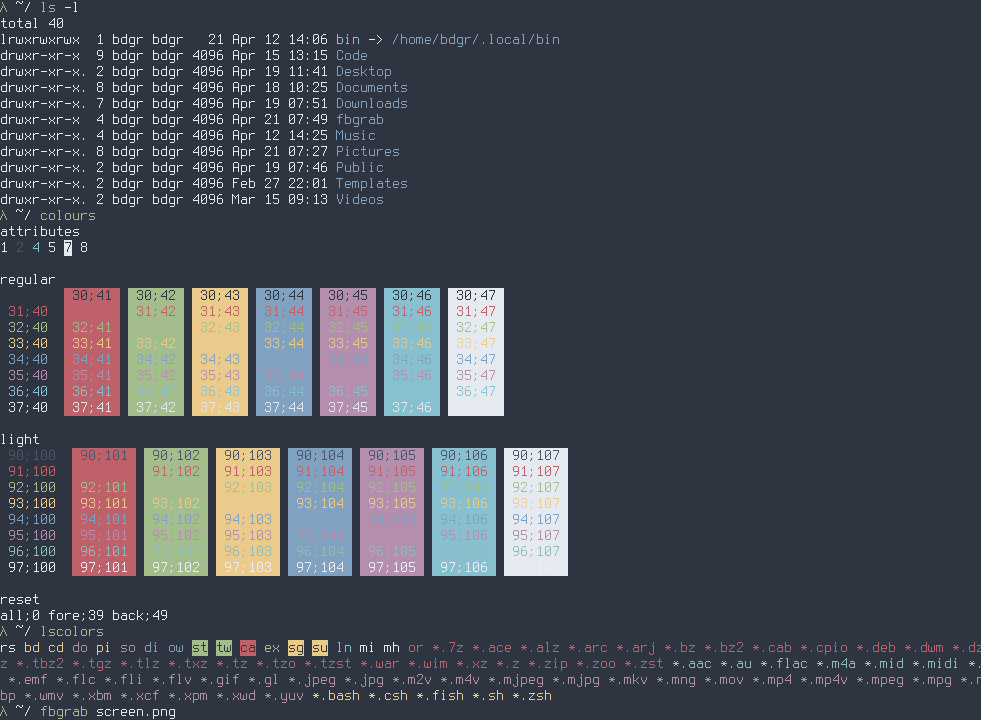

Colors that match those used in `nord-gnome-terminal`.



Make sure this one gets executed on login:

```shell
if [ "$TERM" = "linux" ] ; then
    echo -en "\e]P02e3440" # black
    echo -en "\e]P84c566a" # darkgrey
    echo -en "\e]P1bf616a" # darkred
    echo -en "\e]P9bf616a" # red
    echo -en "\e]P2a3be8c" # darkgreen
    echo -en "\e]PAa3be8c" # green
    echo -en "\e]P3ebcb8b" # brown
    echo -en "\e]PBebcb8b" # yellow
    echo -en "\e]P481a1c1" # darkblue
    echo -en "\e]PC81a1c1" # blue
    echo -en "\e]P5b48ead" # darkmagenta
    echo -en "\e]PDb48ead" # magenta
    echo -en "\e]P688c0d0" # darkcyan
    echo -en "\e]PE8fbcbb" # cyan
    echo -en "\e]P7e5e9f0" # lightgrey
    echo -en "\e]PFeceff4" # white
    clear
fi
```

And this one on logout:

```shell
[ "$TERM" = "linux" ] && reset
```

`\e]P[0-f]` is an escape sequence that sets one of sixteen framebuffer console colors.