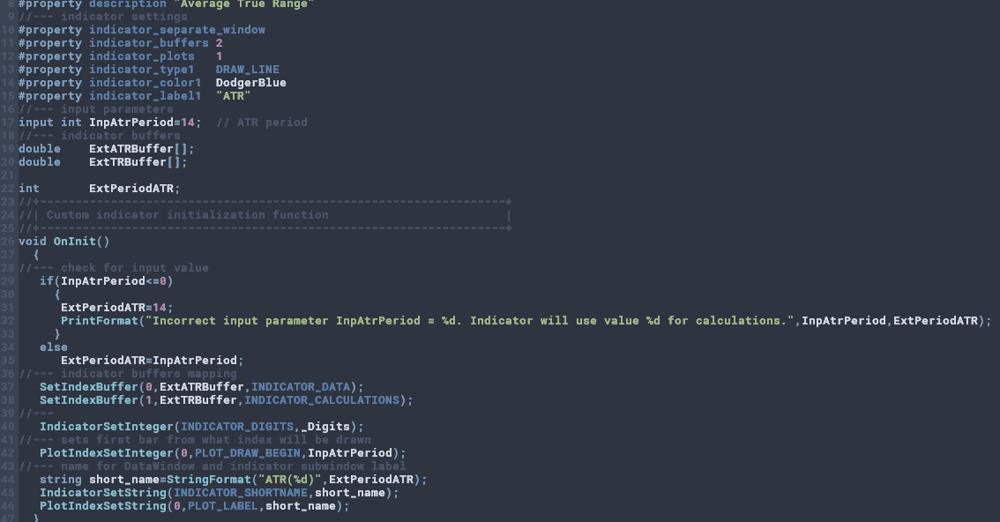

Edit `config/metaeditor.ini` and replace `[Colors]` section with:

```ini
[Colors]
Color0=4207662
Color1=15326936
Color3=6968908
Color4=5390907
Color5=12689793
Color6=6968908
Color7=11374260
Color8=12689793
Color9=9223843
Color10=11305310
Color11=13680776
Color12=13680776
Color13=15326936
Color14=15326936
Color15=15326936
Color16=5390907
```
